# 📦 Supply of Goods Management & Distribution Platform

## 🚀 Overview

The **Supply of Goods Management & Distribution Platform** is a full-stack web application designed to digitally manage and streamline the supply chain process between **Manufacturers, Wholesalers, and Consumers**.

This system provides a centralized and structured environment to handle **product lifecycle, order processing, inventory management, and delivery tracking**, ensuring transparency, efficiency, and secure access across all user roles.

---

## 🎯 Objectives

- To create a unified platform for managing supply chain operations  
- To automate product, order, and inventory flow across different roles  
- To implement secure authentication and role-based access  
- To reduce manual errors in stock and order tracking  
- To provide scalable and maintainable system architecture  

---

## 👥 Team Members

- **Tikeshwar Omkar Barade** – Team Lead  
- **Pranav Pramod Pardeshi** – Frontend Lead  
- **Atharva Ravindra Gotmare** – Frontend Developer  
- **Trijal Singh** – Frontend Developer  
- **Abhay Singh Kushwaha** – Backend Developer  

---

## ⚙️ Technology Stack

### Frontend
- Angular  
- TypeScript  
- HTML, CSS  

### Backend
- Spring Boot  
- Spring Security  
- JPA & Hibernate  

### Database
- MySQL  

### Email Integration
- SendGrid API  

---

## 🔐 Security Implementation

- OTP-based email verification for registration and password reset  
- CAPTCHA validation during login  
- JWT-based authentication for secure API communication  
- Role-based access control for authorization  
- Session tracking using `loginStatus` and `lastActivityTime`  

---

## 💡 Key Features

### 👨‍🏭 Manufacturer
- Create and manage products  
- Upload product images  
- View wholesaler orders  
- Update order status  

### 🧑‍💼 Wholesaler
- Browse products from manufacturers  
- Place purchase orders  
- Manage inventory  
- View and process consumer orders  
- Track order status  

### 👤 Consumer
- Browse available products  
- Place orders  
- Track deliveries  
- Submit feedback  

---

## 🏗️ System Architecture

The project follows a layered architecture:

Frontend (Angular)
↓
Controller Layer (Spring Boot)
↓
Service Layer (Business Logic)
↓
Repository Layer (JPA)
↓
Database (MySQL)

This structure ensures **clean separation of concerns, maintainability, and scalability**.

---

## 🔄 Supply Chain Flow

Manufacturer → Wholesaler → Consumer

1. Manufacturer creates product and manages stock  
2. Wholesaler places order to manufacturer  
3. Manufacturer updates order to "DELIVERED"  
   - Product stock decreases  
   - Wholesaler inventory increases  
4. Consumer places order from wholesaler inventory  
5. Wholesaler delivers order  
   - Inventory stock decreases  

---

## 📊 Core Modules

- Authentication & Authorization (OTP + JWT)  
- Product Management  
- Order Management  
- Inventory Management  
- Feedback System  
- Image Upload Handling  

---

## 🗃️ Database Design

The application uses the following core entities:

- **User** – Stores all roles (Manufacturer, Wholesaler, Consumer)  
- **Product** – Managed by manufacturers  
- **Order** – Represents order flow between roles  
- **Inventory** – Stores wholesaler stock  
- **Feedback** – Stores consumer feedback  

Entity relationships are managed using JPA annotations:
- `@ManyToOne`
- `@OneToMany`
- `@JoinColumn`

---

## 🛠️ Setup Overview

### Backend

- Configure database connection in `application.properties`  
- Ensure MySQL database setup  
- Run the Spring Boot application using Maven  

### Frontend

- Install Angular dependencies using npm  
- Run Angular application using Angular CLI  

---

## 🌐 Default Ports

- Backend: `http://localhost:8080`  
- Frontend: `http://localhost:4200`  

---

## 📸 Application Screens

- Login & Registration  
- Role-based Dashboards  
- Product Management  
- Orders and Inventory  
- Consumer Order Flow  

---

## ⚠️ Challenges Faced

- Maintaining accurate stock synchronization between roles  
- Preventing duplicate stock updates during order delivery  
- Handling OTP verification flows reliably  
- Managing session state along with JWT authentication  

---

## 📚 Learnings

- End-to-end full-stack development (Angular + Spring Boot)  
- REST API design and integration  
- JWT authentication and security flow  
- Database design using JPA & Hibernate  
- Real-world implementation of supply chain logic  

---

## 📸 Application Screens

---

### 🔐 Authentication

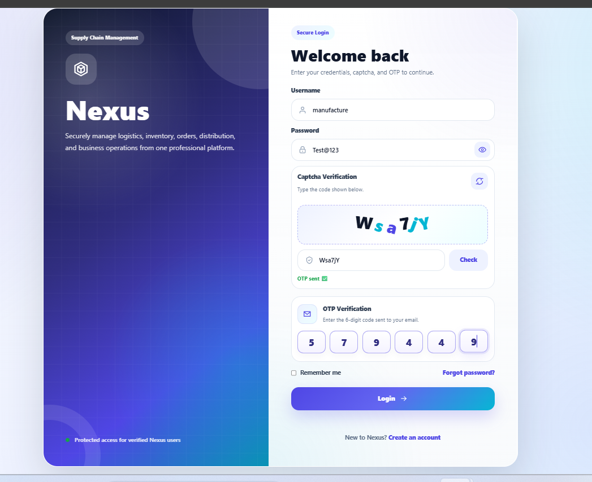
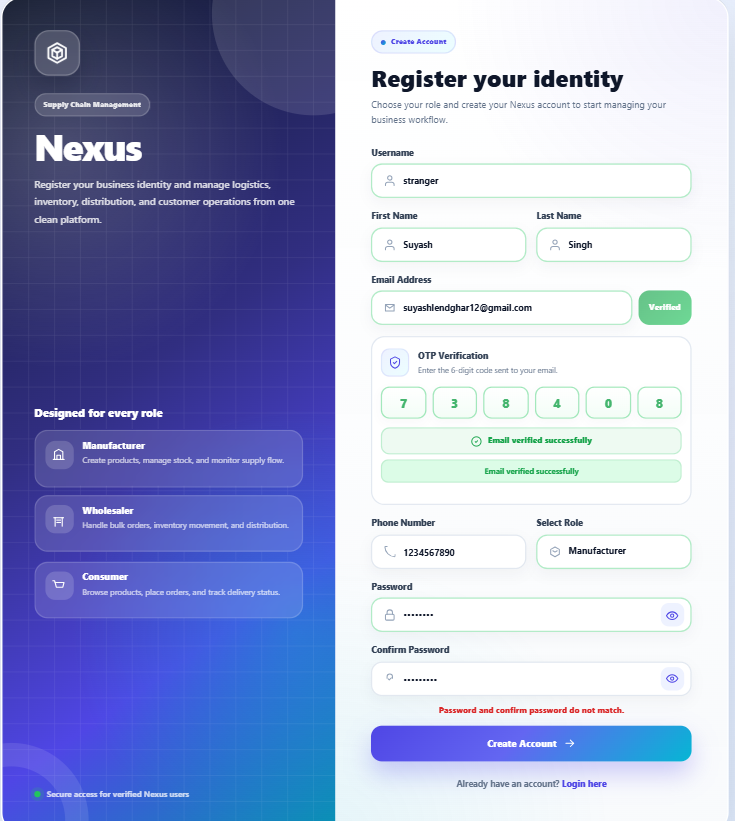

---

### 🏠 Landing Pages

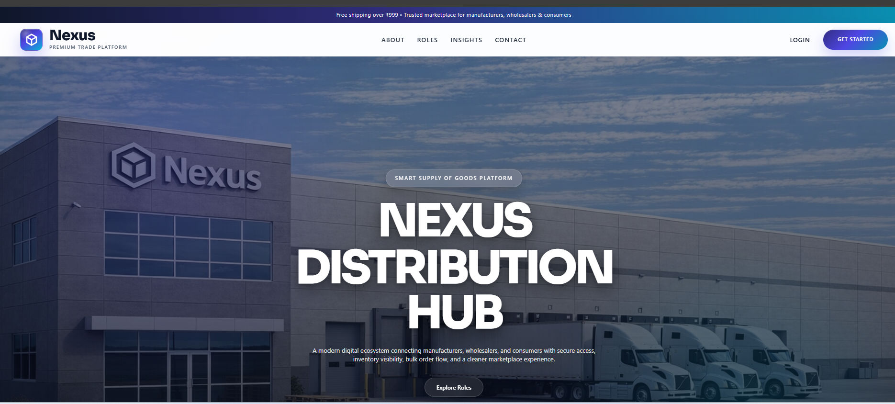
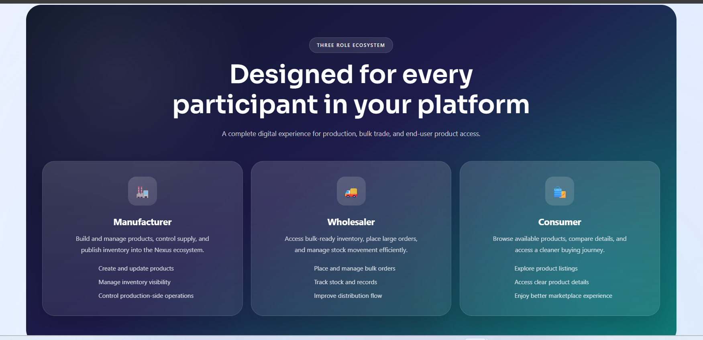

---

### 👤 Consumer Dashboard

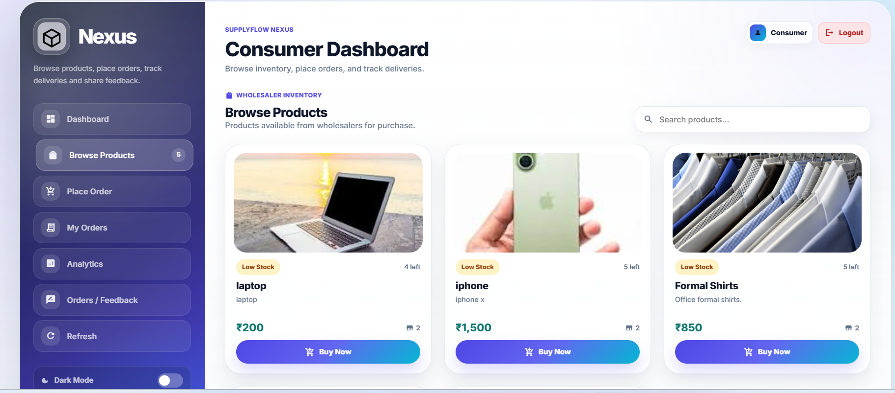
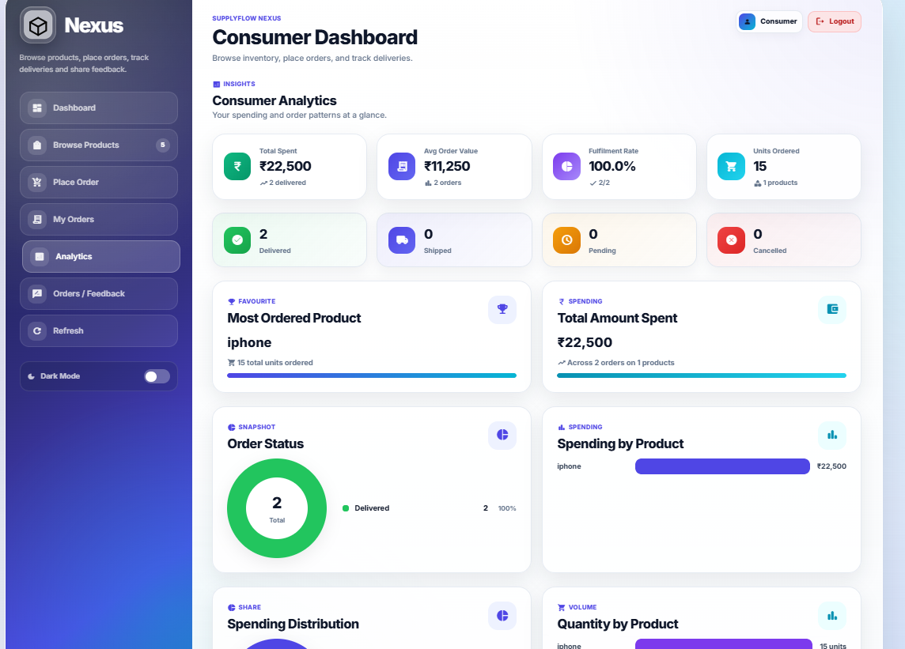
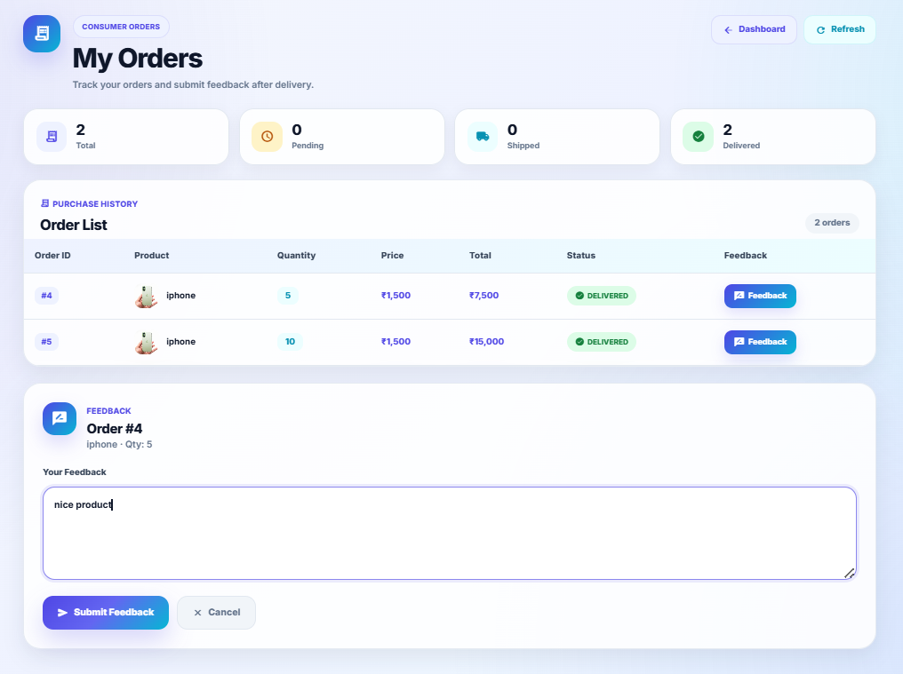

---

### 🏭 Manufacturer Dashboard

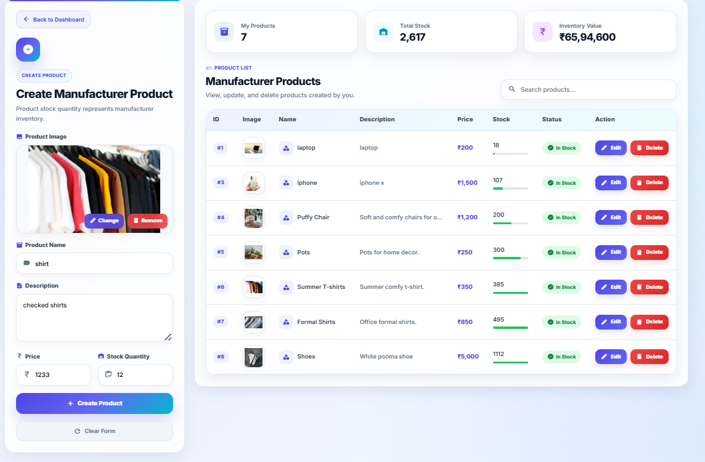
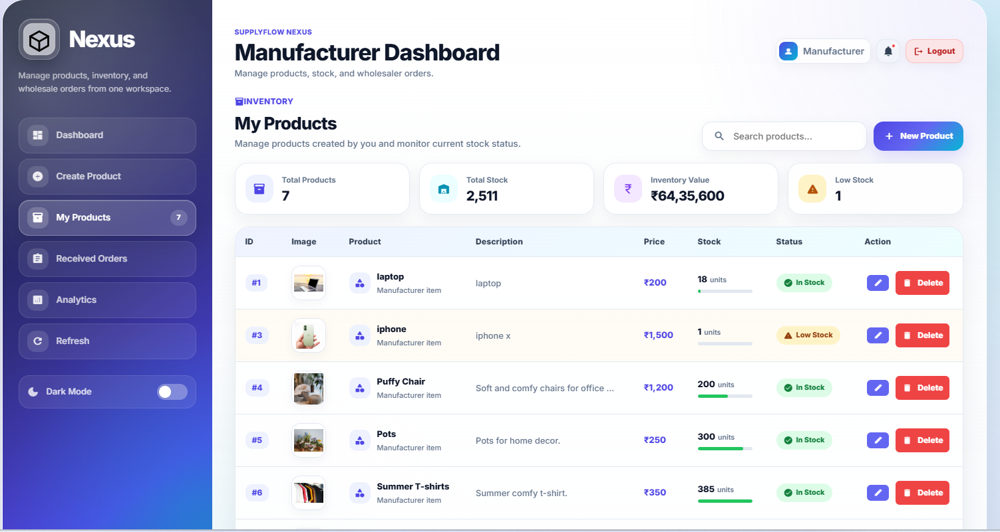
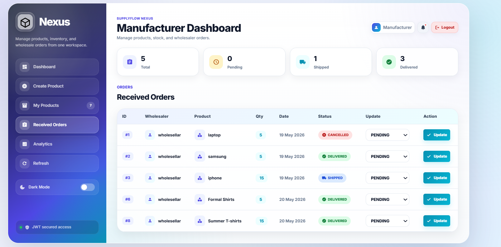
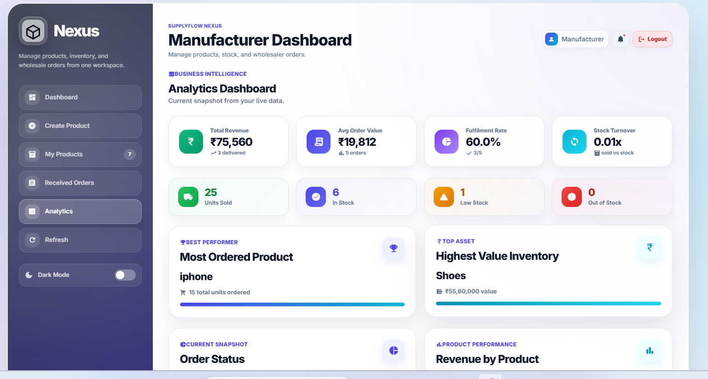
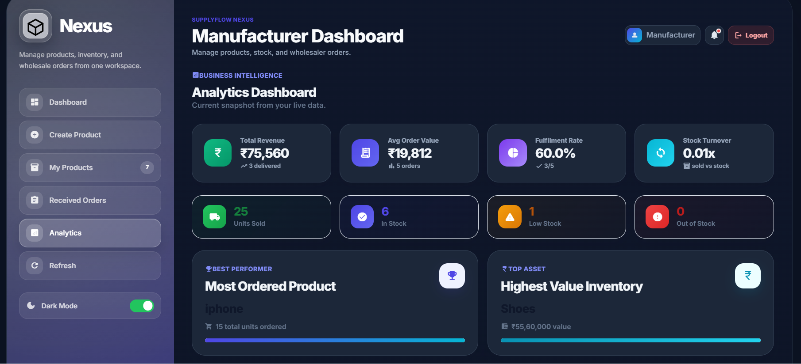

---

### 📦 Wholesaler Dashboard

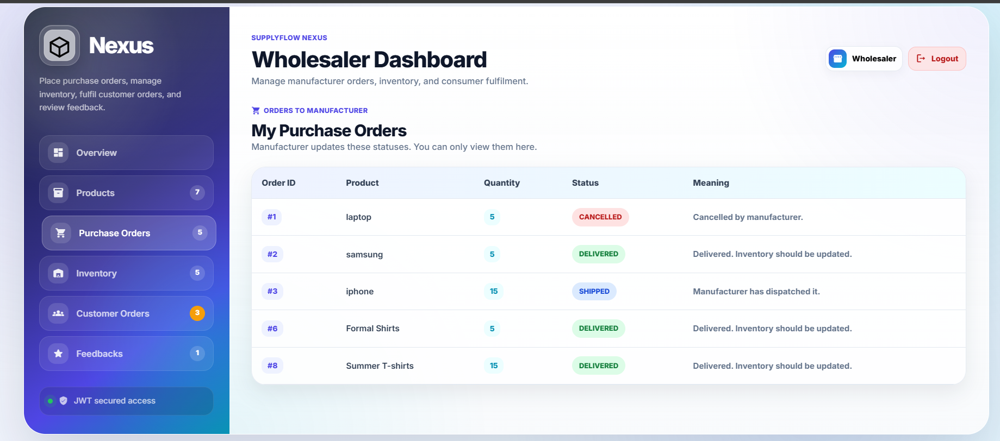
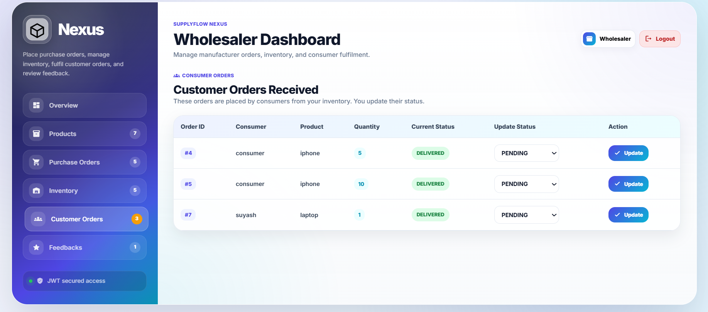

## 📈 Future Enhancements

- Payment gateway integration  
- Invoice and billing system  
- Advanced analytics and reporting  
- Shipment tracking system  

---

## ✅ Conclusion

This platform demonstrates a **complete and practical implementation of a supply chain management system**,
combining **secure authentication, structured architecture, and efficient data flow**.

It ensures scalability, maintainability, and real-time management of goods distribution across multiple user roles.
